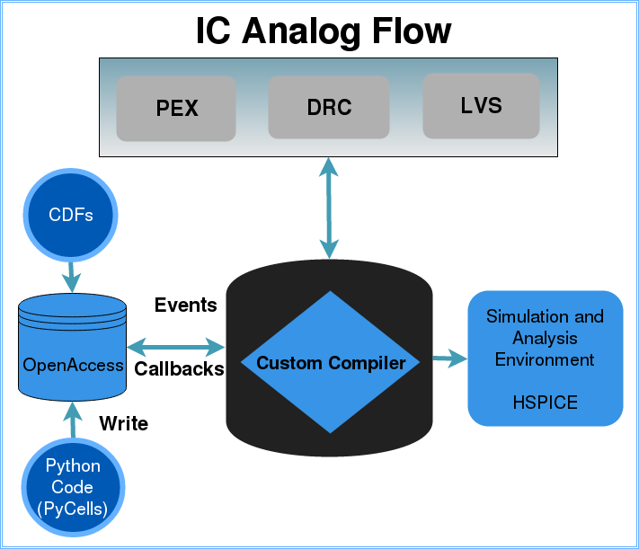
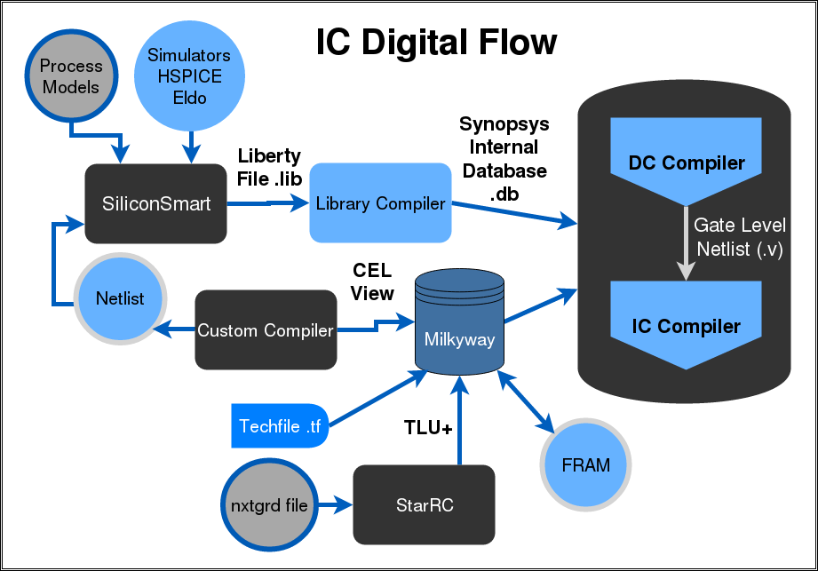
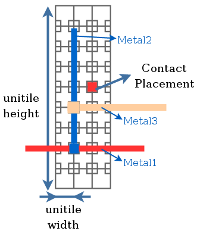
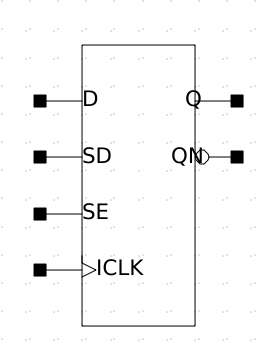
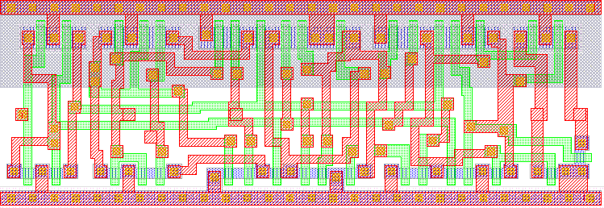

# UNSAM Educational PDK ONC5               
Educational Design Kit for Synopsys Tools with a set of Characterized Standard Cell Library
Preliminary Version - Work in Progress

## Authors ##
* Leandro Tozzi ltozzi@unsam.edu.ar
* Yao-Ming Kuo ykuo@frba.utn.edu.ar
* Leandro Arana larana@fi.uba.com.ar
* Cristian Marchese cmarchese@est.frba.utn.edu.ar
* Luis Seva lseva@est.frba.utn.edu.ar

## Disclaimer
This project does not contain any confidential information. You must contact MOSIS and sign the corresponding NDA to obtain the official PDK. This project is a set of libraries and scripts for use with the synopsys tools and the official PDK.

## Structure

	dc : DC Compiler
		the simple.tcl script synthesizes an uart with clock gating, which is then used in ICC
	dc / testcase_dft : 
		another script that uses DFT on an adder to test the scan flip flops
	
	icc : IC Compiler
	icc / uart_example :
		run in bash > icc_shell -gui 
		then in icc_shell: source icc_run.tcl > log.txt (Place & Route of the UART)
	icc / icc_onc5: 
		milkyway db
	icc / io_pads: 
		milkyway db (IO Pads)
	icc / gds : 
		std cells gds format

	libs : Libraries .lib .db characterized using Siliconsmart

	siliconSmart: There are the netlist and the scripts used to characterize the cells
	
	verilogs: Verilog models to simulate the characterized cell

Example IC digital flow:
1) Run the script DC (dc/simple.tcl)

		dc_shell -f simple.tcl 

2) Run the script ICC (source icc_run.tcl)

## Introduction
A Process Design Kit (PDK) is a collection of foundry specific data and script files used with electronic design automation tools (EDA) in a chip design flow. PDK’s main components are models, symbols, technology files, parameterized cells (PCells), characterized standard cells, rule files and Milkyway Database. Unlike most MOSIS PDKs this universal PDK is a long term stable version for a well established technology, used as a starting point by most
universities research groups. The developed PDK allows the users to test and implement mixed signal IC in a more efficient way, which is manufacturable.
A set of clock gating and scan flip flop cells were design, tested and included in this work to standout from more unsophisticated standard cell libraries, enabling designers the possibility of low power and design for testeability on this technology.
The process was divided into two major design flows: Analog design flow, and Digital design flow.

---

## Analog Design Flow
This flow consist of:
* PyCells: OpenAccess library with parametric cells, written in Python.
* Callbacks, Component Description Format (CDFs) for Synopsis Custom Compiler.
* Layermap, DRC/LVS, simulation models (given by MOSIS).
* Schematic, Symbol & Layout of standard cells in Custom Compiler.

PCell is a concept used widely in the automated design of analog integrated circuits. A PCell represents a part or a component of the circuit which structure is dependent on one or more parameter. The three major steps involved in the development are:
* Define the parameters which can be used to customize the parameterized cell.
* Read and process the parameter values which are set by the user of the parameterized cell.
* Create the layout of the PCell circuit, based upon the parameter values processed in the second step and the design rules for the technology used.

## Digital Design Flow

This flow consist of:
* Techfile of the process.
* TLUplus generated by Synopsys StarRC.
* Liberty file for standard cell (Synopsys SiliconSmart).
* Milkyway database: Synopsys CEL & FRAM views for ICC Compiler, Antenna properties, Place & Route boundary.
* Example Scripts

### Characterization

The standard cell characterization flow begins with a netlist of the cell in SPICE. This netlist can be obtained directly from the schematic, or a parasitic extraction may be performed (using Calibre PEX) from the layout, obtaining a more realistic netlist of the cell. Also the electrical model of the cell's transistors was used.  

The characterization is taken care using Synopsys SiliconSmart. SPICE netlist and foundry models were used as input files, and a configuration file is needed to set simulation and attribute parameters for the cells. The characterization result is a Composite Current Source (CCS) model called liberty file which provides timing, noise, static and dynamic power of each cell.

CCS modeling is used nowadays for low power applications. The digital standard cell library also contains classic NLDM (Non Linear Delay Model) and Verilog models that is useful for Gate Level Netlist Post-Simulation.

### EDA Database (Milkyway)

Milkyway is the database underlying most of Synopsys's physical design tools:

* IC Compiler and Astro physical synthesis.
* Star-RCXT RC parasitic extractor.
* Hercules LVS-DRC physical verification.

Milkyway stores topological, parasitic and timing data. As database inputs for the Milkyway we used:

* Techfile obtained from MOSIS and modified to fit standard cell's pitches for metal layers and unit-tile.
* TLUplus models are a set of models containing advanced process effects that can be used by the parasitic extractors in Synopsys place-and-route tools for modeling.
* CEL view contains the layout of the standard cells.

Milkyway properties are set to configure the cell pins, place and route, boundaries, antenna properties, etc. Also FRAM view is generated which is useful for the place and route when the ICC Compiler is used.

### Synthesis, Place and Route 

After the Milkyway and database were created we can synthesize the RTL and perform a place and route, accomplishing the constrains set. DC Compiler generates a Verilog Gate Level Netlist from this RTL.

The Verilog Gate Level Netlist describes the logical functionality of the circuit/system in terms of its structure, based on logic gates (including compound gates and cells from the standard cell library).

Verilog Gate Level Netlist is included in ICC Compiler which performs the actual place and route of the standard cells, considering the clock tree, clock gating, timing constrains and etc.

## Standard Cell Library

A set of Standard Cells was developed for this PDK. It contains a total of 100 cells. The library includes typical combinational logic cells: inverters, buffers ; 2-6 input AND, NAND, NOR, input-invert NAND cells; 2-3 input OR, XOR cells; 2/1-2/2-3/1-3/2-2/2/2 AND-OR cells; 2/1/1 OR-AND cell; 3/2 OR-NOR cell; multiplexers (2 to 1, 4 to 1); half adder and full adder cells; pos edge DFF; neg edge DFF; pos edge DFF with reset; pos edge DFF with set and reset; scan pos edge DFF; pos edge clock gating cell; pos edge clock gating with pre-control test logic; pos edge clock gating with post-control test logic; antenna cells; feed cells.

In order to obtain high integration density, and low power, the CMOS parameters were chosen to optimized speed (delay time) vs. power consumption. 

After choosing W and L, the cell size is determined according to the routing rules, and a flip flop D size.

### Sizing

The Delay vs Width function was simulated making use of Synopsys tools by using an inverter with variable size, charging a minimum size inverter.

L of both MOSs (P and N) is set to the minimum while Wn and Wp is varied throughout the simulation, keeping a 2:1 relation between Wp and Wn.
Making the Wn parameter sweep for a wide range (from 0.8um to 30um) we obtained a series of points that were fitted using the minimum square technique in order to get the empirical expression that relates time and power delay to transistor's width (See Paper in 2018 LASCAS).

The value obtained was 0.85um, this was simulated in order to verify the calculations and the optimum value was near 0.9um. Despite this we realized that the efficiency improvement from transistors of Wn=0.8um to Wn=0.9um was almost negligible, and that using Wn=0.8um resulted in an Area reduction. 

### Implementation

The basic cell construction is carried on with a fixed cell height, and a multiple of a minimum cell width known as unit-tile. To determine this unit-tile size we first developed a Flip Flop D cell to determine a minimum necessary height to fit this structure. 

Routing and metal layer rules were also taken in consideration to determine the unit-tile. The routing is executed using the Manhattan approach. In order to be able to route and interconnect each layer, the metal's design rules must be achieve. Minimum third layer pitch is 1.7um, so all horizontally routed metals must have this pitch. On the other hand, vertically routed metals pitch will be 1.6um, which apply to the second metal layer. Finally the unit-tile height must be a multiple of 1.7um, whereas the width a multiple of 1.6um.

## Special Cells

### Design for testeability

Design for testability (DFT) consists of IC design techniques that add testability features to a hardware product design. The added features apply manufacturing tests to the designed hardware and make it easier to check.
The purpose of DFT is to validate that the product hardware contains no manufacturing defects that could adversely affect the product’s correct functioning.

Scan chain is a technique used in DFT. The objective is to make testing easier by providing a simple way to set and observe every flip-flop in an IC.

A scan D Flip Flop was implemented for this reason. This special cell consist of a multiplexer located before the Flip Flop:

### Clock Gating

In synchronous digital circuits the clock net is responsible for significant part of dynamic power dissipation. Clock gating is a technique for reducing the power consumption switching off parts of a circuit. 

This technique reduces clock network power dissipation, relaxes datapath timing, and reduces routing congestion by eliminating feedback multiplexer loops. It can also save area by reducing the number of gates.

In this work, three different clock gating topologies were developed: Latch Positive Edge, Latch Positive Edge Precontrol and Latch Positive Edge Postcontrol.

* Latch Positive Edge: Rising edge triggered register with clock gating.
* Latch Positive Edge Precontrol: Rising edge triggered register with clock gating and test control logic located before the latch.
* Latch Positive Edge Postcontrol: Rising edge triggered register with clock gating and test control logic located after the latch.

## Future works

## Collaborations

## Acknowledgements
The authors would like to thank to the [Centro de Micro y Nano Electronica del Bicentenario (CMNB-INTI)](http://www.inti.gob.ar/microynanoelectronica/cmnb.htm "CMNB-INTI") for the use of the testing facilities and to Ronald Valenzuela (Synopsys - Chile) and Victor Grimblatt (Synopsys - Chile) for their contributions and support. We also thank [MOSIS](https://www.mosis.com/), [Synopsys](https://www.synopsys.com/) and [Mentor Graphics](https://www.mentor.com/) academic programs. The integrated circuit was designed using Synopsys tools under the Synopsys University Program. The test chips were fabricated through the MOSIS foundry service supported by the MOSIS Educational Program (MEP).
