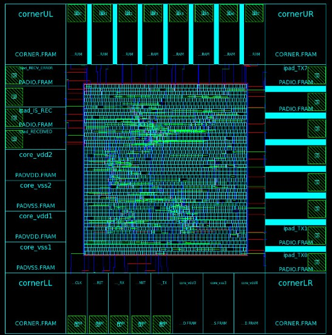

# UNSAM Educational PDK ONC5 - ICC 

Celdas Basicas ONC5
-------------------

## Description: ICC Cell Library 

## Structure

	icc : IC Compiler
	icc / uart_example :
		run in bash > icc_shell -gui 
		then in icc_shell: source icc_run.tcl > log.txt (Place & Route of the UART)
	icc / icc_onc5: 
		milkyway db
	icc / io_pads: 
		milkyway db (IO Pads)
	icc / gds : 
		std cells gds format

## TLUPlus : File generation

* If the Foundry provides an .nxtgrd file (in the PDK),  it already contains the necessary things to assemple the .itf file. If we look at the beginning of the .nxtgrd file, it is written similarly to an .itf file and contains all the information we need.

* In order to get the .itf file we run the following script:

```
	# Find only lines that begin with a comment character
	# Delete everything from the pattern "end of itf file" to the end of the file
	# Delete everything from the pattern "TimeStamp" to the pattern "echoing ITF file"
	# From what is remaining, which is the .itf file commented out, remove the first comment character
 
	grep '^\$' some.nxtgrd | \
      	sed -e '/end of itf file/,/$$/d' \
            -e '/TimeStamp/,/echoing ITF file/d' \
            -e 's/^\$//'
```

* Then we have to generate the TLU File using .itf

```
	grdgenxo -itf2TLUPlus -i cb_mini_max.itf -o cb_mini_max.capTable
```

* Once generated the TLUPlus, put it in ** PDK_ONC5/libs** folder.

## Example

* To run a ICC Compiler quick example:

	icc_shell -gui

* Run the icc_run script using icc_shel:

	source icc_run.tcl > log.log

* icc_run is an example to validate the IC digital flow

